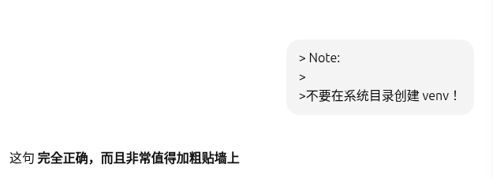

# 神经网络

## 人工神经网络 VS 生物神经网络

人工：正向传播+反向传播 调整网络（训练）

生物：调整联结

## 什么是神经网络

`input later`---`hidden layers`---`output layer` 

## 梯度下降

局部最优 全局最优

## 黑盒？

- "宝宝" (feature) -> "宝宝经过第一层加工" (feature representation)

- 黒盒不黑： 比如在某一层中用几个参数（代表特征）来表示（比如三个参数构成一个空间，两个参数构成一个平面），通过位置判断，就能知道什么东西是什么

- 可以把神经为网络的部分拆开（比如只扔掉输出层），复用到别的地方

## theano 

### 创建虚拟环境：

```sh
python3 -m venv theano_env
source theano_env/bin/activate
```
激活成功标志：zsh神秘小图标 `  theano_env `


> Note:
>
>不要在系统目录创建 venv！ 



退出虚拟环境
```sh
deactivate
```

删除虚拟环境
```sh
sudo rm -rf theano_env
```

>Note:
>
>Theano 1.0.5 不支持 Python 3.12!
>在 Python 3.12 里：configparser.SafeConfigParser 已经被移除

”解决方案“：安装 Python 3.8（或 3.9）
```sh
sudo apt install python3.8 python3.8-venv
cd bulabulabula
python3.8 -m venv theano_env
source theano_env/bin/activate
pip install theano==1.0.5
```
但是又失败：
```sh
❯ sudo apt install python3.8 python3.8-venv 
Reading package lists... Done 
Building dependency tree... Done 
Reading state information... Done 
E: Unable to locate package python3.8 
E: Couldn't find any package by glob 'python3.8' 
E: Unable to locate package python3.8-venv 
E: Couldn't find any package by glob 'python3.8-venv'
```

>Note:
>
>我的`Ubuntu`版本的软件源里已经不提供`python3.8`了
>所以`apt`找不到它

暂时放弃